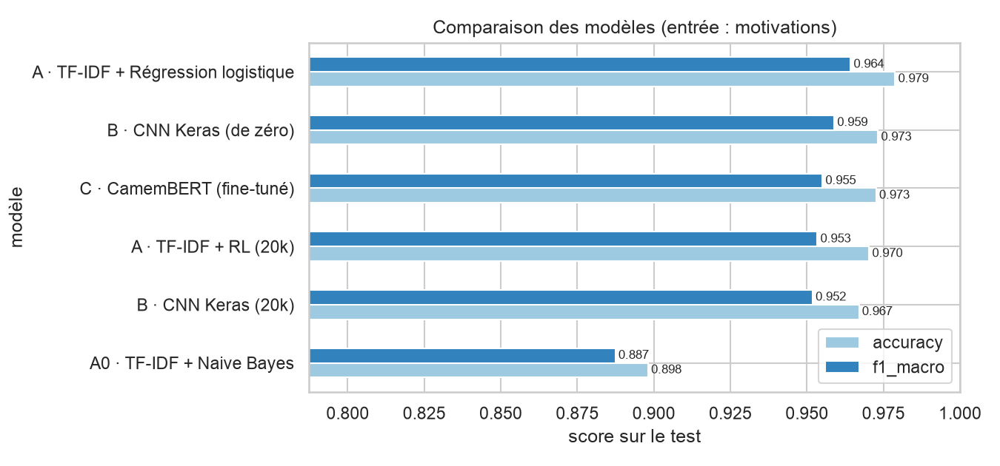

# ⚖️ Legal Case Information Extraction (NLP)

Extraction automatique d'informations structurées à partir de décisions de justice françaises.

On donne un **arrêt de la Cour de cassation** (PDF natif ou scanné, ou texte) et le système renvoie un **JSON** avec les métadonnées de l'affaire, les faits, les textes de loi cités, l'issue de la décision et une prédiction du modèle NLP.

📄 **Rapport complet :** [`report/rapport_extraction_decisions_justice.pdf`](report/rapport_extraction_decisions_justice.pdf)

---

## 📑 Sommaire

1. [Le problème](#-le-problème)
2. [Les données](#-les-données)
3. [Le pipeline](#-le-pipeline)
4. [Les modèles comparés](#-les-modèles-comparés)
5. [Résultats](#-résultats)
6. [Structure du dépôt](#-structure-du-dépôt)
7. [Installation](#️-installation)
8. [Utilisation](#️-utilisation)
9. [Limites](#️-limites)
10. [Références](#-références)

---

## 🎯 Le problème

Une décision de justice est un texte **long** (649 mots en médiane, jusqu'à 183 000) et **peu structuré**. Pour un juriste, retrouver « qui, quand, sur quelle loi, avec quel résultat » demande de tout lire.

Ce projet automatise cette lecture. Il extrait 4 blocs d'information :

| Bloc | Exemple |
|---|---|
| **Métadonnées** : cour, chambre, date, n° de pourvoi, président | `Chambre criminelle`, `2026-07-29`, `26-83.088`, `M. Sottet` |
| **Récit** : faits, moyens (arguments) | « Le 24 février 2026, M. [H] [Q] a présenté une requête… » |
| **Fondements juridiques** : textes de loi, décision attaquée | `article 803-8 du code de procédure pénale`, `Cour d'appel de Nouméa` |
| **Issue** : verdict, ordres, motifs | `Cassation`, « RENVOIE la cause et les parties… » |

### Petit lexique juridique

- **Arrêt** : décision rendue par une cour (ici la Cour de cassation, la plus haute juridiction judiciaire française).
- **Pourvoi** : recours d'une partie qui conteste une décision d'appel devant la Cour de cassation.
- **Cassation** : la Cour annule la décision attaquée. **Rejet** : le pourvoi échoue, la décision attaquée reste valable.
- **Irrecevabilité** : le pourvoi n'est même pas examiné (hors délai, mal formé…).
- **Moyens** : les arguments de la partie qui attaque la décision.
- **Motivations** : le raisonnement de la Cour.
- **Dispositif** : la décision finale, après « PAR CES MOTIFS ».
- **Visa** : texte de loi sur lequel la Cour fonde sa décision (« Vu l'article… »).

### Exemple de sortie (arrêt réel de juillet 2026)

```json
{
  "metadata": {
    "court": "Cour de cassation",
    "chamber": "Chambre criminelle",
    "date": "2026-07-29",
    "case_number": "26-83.088",
    "president": "M. Sottet"
  },
  "narrative": {
    "facts": "Faits et procédure\n1. Il résulte de l'ordonnance attaquée ...",
    "claims": "Examen du moyen\nEnoncé du moyen\n6. Le moyen critique l'arrêt attaqué ..."
  },
  "legal_foundations": {
    "statutes": ["article 803-8, ii, du code de procédure pénale",
                 "article 6 de la convention européenne des droits de l'homme"],
    "previous_decision": {"court": "Cour d'appel de Nouméa", "date": "2026-04-30"}
  },
  "outcome": {
    "verdict_rules": "Cassation",
    "verdict_header": "Cassation",
    "orders": ["CASSE et ANNULE, en toutes ses dispositions, l'ordonnance susvisée ...",
               "RENVOIE la cause et les parties devant ...",
               "DIT n'y avoir lieu à mise en liberté de M. [Q]"],
    "reasoning": "Réponse de la Cour\nSur le moyen, pris en ses première et deuxième branches ..."
  },
  "prediction": {
    "model": "A · spaCy + TF-IDF + régression logistique",
    "verdict": "Cassation",
    "confidence": 0.9902,
    "probabilities": {"Rejet": 0.004, "Cassation": 0.9902, "Irrecevabilité": 0.0017, "Autre": 0.0042}
  }
}
```

---

## 📊 Les données

**Source :** [antoinejeannot/jurisprudence](https://huggingface.co/datasets/antoinejeannot/jurisprudence) (Hugging Face), construit à partir de **Judilibre**, l'open data officiel de la Cour de cassation. Licence **Etalab 2.0**.

| Caractéristique | Valeur |
|---|---|
| Décisions | **553 075** arrêts de la Cour de cassation |
| Période | 1860 → 2025 (99 % après 1970) |
| Volume | 639 millions de mots |
| Format | JSONL compressé (`.jsonl.gz`), une décision par ligne, ~1 Go |
| Noms des personnes | Pseudonymisés (`Mme [C]`, `[Adresse 1]`) |

Chaque ligne contient le **texte intégral** et des **champs structurés**, qui servent de vérité terrain :

| Champ | Contenu |
|---|---|
| `text` | Texte intégral de la décision |
| `decision_date`, `chamber`, `number`, `ecli` | Métadonnées |
| `zones` | Position (début/fin) des parties : introduction, exposé, moyens, motivations, dispositif |
| `solution` | Issue : Rejet, Cassation, Irrecevabilité… (14 valeurs) |
| `visa` | Textes de loi visés |
| `contested` | Décision attaquée (cour d'appel, date, numéro) |

**Répartition des issues**, regroupées en 4 classes :

| Issue | Nombre | Part |
|---|---:|---:|
| Rejet | 299 765 | 54,2 % |
| Cassation | 169 592 | 30,7 % |
| Irrecevabilité | 22 351 | 4,0 % |
| Autre (déchéance, non-lieu, QPC, annulation…) | 61 367 | 11,1 % |

Les classes sont **déséquilibrées** : on évalue avec le **F1 macro**, qui compte chaque classe à égalité.

**Corpus utilisés :**
- **EDA** : les 553 075 décisions ;
- **Modèles** : 100 000 décisions tirées au hasard parmi celles qui ont des motivations et un dispositif (80 000 train / 10 000 validation / 10 000 test) ;
- **Règles** : 1 959 décisions avec texte intégral et bonnes réponses ;
- **Test « production »** : 3 Bulletins PDF de 2026 (104 arrêts), postérieurs à toutes les données d'entraînement.

---

## 🔧 Le pipeline

```
                    ┌──────────────┐
   Fichier PDF ───▶ │ PDF texte ?  │   (on demande à l'utilisateur, détection automatique par défaut)
                    └──────┬───────┘
              oui ┌────────┴────────┐ non (scanné)
                  ▼                 ▼
             PyMuPDF          Tesseract OCR (français)
                  └────────┬────────┘
                           ▼
              Nettoyage + découpage en arrêts
                           ▼
              ┌─────────────────────────┐
              │ Txt_ToJSON (règles)     │  date, chambre, n° de pourvoi, président,
              │                         │  zones, textes de loi, décision attaquée,
              │                         │  issue (dispositif), ordres
              └────────────┬────────────┘
                           ▼
              ┌─────────────────────────┐
              │ predict.py (modèle NLP) │  lit les motivations,
              │                         │  prédit Rejet / Cassation / ...
              └────────────┬────────────┘
                           ▼
                      JSON final
```

**Comment on sait si un PDF est scanné ?** Si PyMuPDF trouve plus de 100 caractères par page sur les premières pages, le PDF est « natif » (produit par ordinateur). Sinon, les pages sont des images, et on passe par l'OCR.

**Pourquoi les modèles lisent les motivations et pas le dispositif ?** Le dispositif écrit la réponse en toutes lettres (« CASSE ET ANNULE », « REJETTE »), une simple règle suffit. Les motivations obligent le modèle à comprendre le raisonnement de la Cour.

---

## 🤖 Les modèles comparés

| | Modèle | Idée | Outils |
|---|---|---|---|
| **Règles** | Verbes du dispositif | « CASSE » → Cassation, « REJETTE » → Rejet… | regex |
| **A** | spaCy + TF-IDF + régression logistique | tokenisation, lemmatisation, mots vides (sauf négations), puis poids TF-IDF et classifieur linéaire | spaCy, scikit-learn |
| **B** | CNN Keras entraîné de zéro | embeddings appris + convolution 1D sur les lemmes | TensorFlow / Keras |
| **C** | CamemBERT fine-tuné | modèle de langue français pré-entraîné, adapté à la tâche (256 derniers tokens des motivations) | TensorFlow, transformers |

---

## 📈 Résultats

### Extraction par règles (1 959 décisions avec la bonne réponse)

| Champ | Score |
|---|---:|
| Date de la décision | 93,3 % |
| Chambre | 96,2 % |
| Textes de loi du visa retrouvés | 98,5 % |
| Cour d'appel attaquée | 79,4 % |
| N° de pourvoi | 41,9 % (99 % après 2015 ; absent du texte des décisions anciennes) |

### Classification de l'issue (test : 10 000 décisions, entrée = motivations)

| Modèle | Exemples d'entraînement | Accuracy | F1 macro | Temps d'entraînement |
|---|---:|---:|---:|---:|
| Règles (dispositif) | — | 0,963 | 0,933 | — |
| Naive Bayes | 80 000 | 0,898 | 0,887 | 9 s |
| **A · TF-IDF + régression logistique** | 80 000 | **0,979** | **0,964** | 18 s |
| B · CNN Keras | 80 000 | 0,973 | 0,959 | 111 s |
| A · TF-IDF + régression logistique | 20 000 | 0,970 | 0,953 | 6 s |
| B · CNN Keras | 20 000 | 0,967 | 0,952 | 51 s |
| **C · CamemBERT** | 20 000 | **0,973** | **0,955** | 91 min |

- Avec 80 000 exemples, le modèle le plus simple (**A**) est le meilleur : c'est le **modèle final** (choisi sur la validation).
- **À données égales** (20 000 exemples), **CamemBERT** passe devant.
- Les motivations contiennent des formules très standardisées (« violé le texte susvisé », « le moyen n'est pas fondé »), ce qui explique les scores élevés.

### Test « production » sur les PDF de 2026 (95 arrêts, après la période d'entraînement)

| Méthode | Accuracy |
|---|---:|
| Règles (dispositif) | 100,0 % |
| A · TF-IDF + régression logistique | 95,8 % |
| B · CNN Keras | 88,4 % |
| C · CamemBERT | **96,8 %** |

Sur ces décisions récentes, CamemBERT **généralise le mieux**, alors que le CNN entraîné de zéro chute.

Tous les détails (F1 par classe, matrices de confusion, analyse d'erreurs) sont dans [`notebooks/02_NLP.ipynb`](notebooks/02_NLP.ipynb) et le [rapport](report/rapport_extraction_decisions_justice.pdf).



---

## 📁 Structure du dépôt

```
.
├── README.md
├── requirements.txt            # dépendances avec versions exactes
├── methodologie.txt            # plan de la démarche
├── data/
│   ├── raw/                    # données brutes (ignoré par git, ~1 Go)
│   ├── processed/              # corpus préparés (ignoré par git, ~120 Mo)
│   └── pdf/                    # 3 Bulletins PDF de démonstration (2026)
├── notebooks/
│   ├── 01_EDA.ipynb            # exploration des données
│   └── 02_NLP.ipynb            # règles, spaCy, modèles A/B/C, évaluation
├── scripts/
│   ├── download_data.py        # téléchargement d'un échantillon
│   ├── prepare_data.py         # construction des corpus (à lancer une fois)
│   ├── Txt_ToJSON.py           # PDF/texte → JSON
│   └── predict.py              # JSON → prédiction du modèle
├── models/                     # modèles entraînés + final_model.json
├── output/
│   ├── json/                   # JSON produits à partir des PDF
│   └── predictions/            # JSON + prédiction du modèle
├── figures/                    # graphiques (EDA, comparaison des modèles)
├── results/                    # tableaux de résultats (CSV)
└── report/
    ├── build_report.py         # génère le rapport PDF
    └── rapport_extraction_decisions_justice.pdf
```

---

## ⚙️ Installation

Testé sur **macOS (Apple Silicon M4, 16 Go)** avec **Python 3.12**.

**1. Cloner le dépôt**

```bash
git clone https://github.com/Wissem-Sahli-Engineer/Legal-Case-Information-Extraction-NLP.git
cd Legal-Case-Information-Extraction-NLP
```

**2. Installer Tesseract (OCR) avec la langue française**

```bash
brew install tesseract
curl -L -o /opt/homebrew/share/tessdata/fra.traineddata \
  https://github.com/tesseract-ocr/tessdata_fast/raw/main/fra.traineddata
```

**3. Créer l'environnement Python 3.12**

```bash
python3.12 -m venv .venv
source .venv/bin/activate
pip install -r requirements.txt
python -m spacy download fr_core_news_sm
python -m ipykernel install --user --name legal-nlp --display-name "Python 3.12 (legal-nlp)"
```

> ⚠️ Python 3.13 ou 3.14 ne fonctionnent pas : TensorFlow 2.18 ne les supporte pas.
> Sous Linux ou Windows, retire la ligne `tensorflow-metal` de `requirements.txt`.

**4. Télécharger et préparer les données** (~1 Go, ~10 min)

```bash
mkdir -p data/raw
curl -L -o data/raw/cour_de_cassation.jsonl.gz \
  "https://huggingface.co/datasets/antoinejeannot/jurisprudence/resolve/main/cour_de_cassation.jsonl.gz"
python scripts/prepare_data.py
```

**Vérifier que le GPU est détecté :**

```bash
python -c "import tensorflow as tf; print(tf.config.list_physical_devices('GPU'))"
```

---

## ▶️ Utilisation

**1. Explorer les données et entraîner les modèles** (dans l'ordre, noyau « Python 3.12 (legal-nlp) ») :

```bash
jupyter notebook notebooks/01_EDA.ipynb     # ~2 min
jupyter notebook notebooks/02_NLP.ipynb     # ~2 h (dont ~1 h 30 pour CamemBERT)
```

**2. Transformer un PDF en JSON**

```bash
python scripts/Txt_ToJSON.py data/pdf/Bulletin_criminel_2026-7.pdf -o output/json
```

Le script demande si le PDF est natif ou scanné (Entrée = détection automatique), extrait le texte, repère chaque arrêt et écrit un JSON par arrêt. Pour forcer l'OCR : `--type scanne`.

**3. Prédire l'issue à partir du JSON**

```bash
python scripts/predict.py output/json/ -o output/predictions            # modèle final
python scripts/predict.py output/json/ -o output/predictions --model A  # modèle A, B ou C
```

**4. Régénérer le rapport PDF**

```bash
python report/build_report.py
```

---

## ⚠️ Limites

- **Legal-BERT non utilisé.** Legal-BERT est pré-entraîné sur des textes juridiques **anglais**. L'utiliser demanderait de traduire les arrêts en anglais au préalable : cela ajoute un modèle de traduction lourd et lent, et la traduction déforme le vocabulaire juridique français (« cassation », « pourvoi », « dispositif » n'ont pas d'équivalent exact en droit anglo-saxon). On utilise donc **CamemBERT**, pré-entraîné sur du français.
- **Puissance de calcul.** Sur un Mac M4, CamemBERT s'entraîne à ~4 exemples/s : il n'a vu que 20 000 décisions (1 époque, 256 tokens). A et B sont aussi entraînés sur ces 20 000 décisions pour une comparaison équitable.
- **Une seule juridiction.** Les modèles sont entraînés sur la Cour de cassation française ; rien ne garantit qu'ils fonctionnent ailleurs (cours d'appel, jurisprudence tunisienne en arabe…).
- **Règles dépendantes du format.** Le numéro de pourvoi n'est écrit que dans 3 % des décisions d'avant 2015 ; les anciennes décisions écrivent la date en toutes lettres (gérée par une règle dédiée).
- **Étiquettes imparfaites.** Les zones et issues sont fournies par Judilibre ; la classe « Autre » regroupe des issues hétérogènes.
- **Modèle CamemBERT non versionné.** Ses poids (~440 Mo) dépassent la limite de GitHub : ils sont ignorés par git et se régénèrent avec `02_NLP.ipynb`.

---

## 📚 Références

- Vaswani et al. (2017). *Attention Is All You Need.* NeurIPS.
- Devlin et al. (2019). *BERT: Pre-training of Deep Bidirectional Transformers for Language Understanding.* NAACL.
- Martin et al. (2020). *CamemBERT: a Tasty French Language Model.* ACL.
- Chalkidis et al. (2020). *LEGAL-BERT: The Muppets straight out of Law School.* Findings of EMNLP.
- Şulea et al. (2017). *Predicting the Law Area and Decisions of French Supreme Court Cases.* RANLP.
- Medvedeva, Wieling, Vols (2023). *Rethinking the field of automatic prediction of court decisions.* Artificial Intelligence and Law.
- Kim (2014). *Convolutional Neural Networks for Sentence Classification.* EMNLP.
- Cour de cassation, [Judilibre](https://www.courdecassation.fr/recherche-judilibre), open data des décisions de justice.
- Jeannot, A. (2024). [Jurisprudence](https://github.com/antoinejeannot/jurisprudence), dataset Hugging Face.

La liste complète (22 références) est dans le rapport.

---

## 📄 Licence

- **Données :** Licence Ouverte Etalab 2.0 (Cour de cassation / Judilibre).
- **Code :** à définir.
